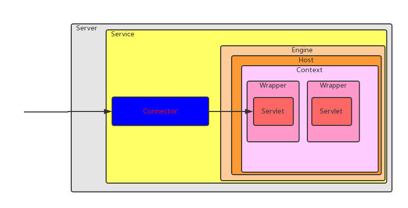

# How Tomcat Works 



## 1.一个简答的Web服务器

问题：请求HttpServer没有看到响应的内容

原因：socket输出之前要有HTTP响应头

```java
output.write("HTTP/1.0 200 OK\r\nContent-Type: text/html\r\n\r\n".getBytes());
```

## 2.一个简单的Servlet容器

面向接口编程

反射

门面模式

## 3. 连接器

使用tomcat-util RequestUtil解析请求参数和cookie

实现的Connector是Tomcat 4默认连接器的一个简化版本


## 4.Tomcat的默认连接器

HTTP 1.1 的新特性

Tomcat 4默认连接器的原理

## 5.Servlet容器

Context, Wrapper Container

容器接到请求后，由Pipeline处理

## 6.生命周期

实现LifeCycle管理组件的生命周期

优雅的启动，关闭关联的组件

## 7.Logger

FileLogger的实现

## 8.加载器

Tomcat为何要实现自己的加载器

Loader, Reloader接口

WepappLoader, WepappClassLoader


## 11.StandardWrapper

StandardWrapper工作原理,loadServlet过程

## 12.StandardContext

start做了哪些工作

Tomcat 4中组件使用各自的线程来处理一些定时任务,Tomcat 5中为了节省资源所有后台任务共享一个线程


## 13.Host和Engine

使用Host,Engine容器

## 14.Server和Service组件

Server优雅的方式启动,关闭整个catalina

## 15.Digester库


## 16.ShutdownHook

没说和Tomcat有啥关系


## TODO

TODO 找一个版本的tomcat,浏览源码

看完后，要画一张请求处理的流程图

梳理组件关联UML图


---


- [Source Code](http://brainysoftware.com/source/9780975212806.zip)
- [Original Repo](https://github.com/serivires/how-tomcat-works)